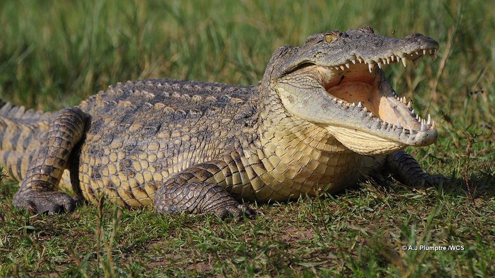
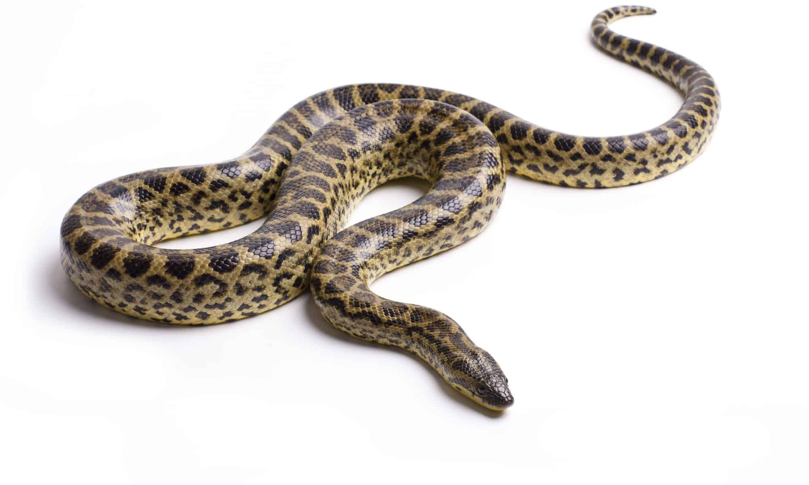
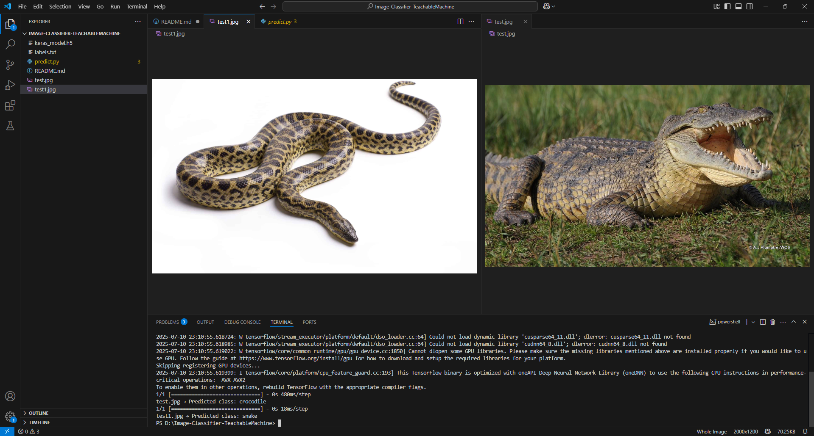

# 🧠 Image Classifier using Teachable Machine

This project is an image classification model built using **Teachable Machine by Google**, exported in **TensorFlow Keras format**, and used in a Python script to classify images.

## 📌 Task Description

- Train an image classifier with at least two classes using Teachable Machine.
- Export the trained model as **Keras (.h5)** format.
- Load and use the model in a Python script to classify images.
- Test using at least 2 different images and print predicted classes.
- Submit the script, model files, and screenshot of results on GitHub.

## 📁 Files in this repo

| File            | Description                          |
|-----------------|--------------------------------------|
| `keras_model.h5` | Trained Keras model file             |
| `labels.txt`     | List of class labels (e.g., snake, crocodile) |
| `predict.py`     | Python script to classify images     |
| `test.jpg`       | Image of a **crocodile**             |
| `test1.jpg`      | Image of a **snake**                 |
| `README.md`      | This file                            |

## 🧪 How to Run

1. Install dependencies:

```bash
pip install tensorflow keras pillow numpy
```
2. Run the script:
```bash
python predict.py
```
3. You should see output like:
```bash
test.jpg  => Predicted class: crocodile
test1.jpg => Predicted class: snake
```
## 📸 Screenshot

### 🔹 Test Images

| Image | Class |
|-------|-------|
|  | Crocodile |
|  | Snake |

### 🔹 Terminal Output


## 🌐 Resources
- [Teachable Machine by Google](https://teachablemachine.withgoogle.com/)
- [TensorFlow Documentation](https://www.tensorflow.org/)

## 🛠 Made by: Musaad Al-Ghashmari
